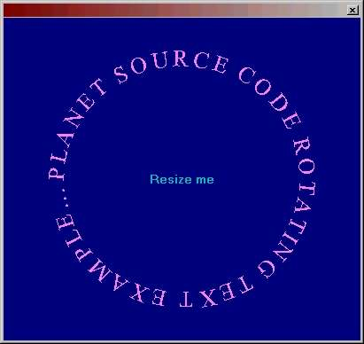



## Rotate text

### Description

Shows how to rotate the orientation of True Type fonts
 
### More Info
 

             |
---                |---
**Submitted On**   |2002-02-19 11:50:28
**By**             |[ULLI](https://github.com/Planet-Source-Code/PSCIndex/blob/master/ByAuthor/ulli.md)
**Level**          |Intermediate
**User Rating**    |5.0 (65 globes from 13 users)
**Compatibility**  |VB 6\.0
**Category**       |[Graphics](https://github.com/Planet-Source-Code/PSCIndex/blob/master/ByCategory/graphics__1-46.md)
**World**          |[Visual Basic](https://github.com/Planet-Source-Code/PSCIndex/blob/master/ByWorld/visual-basic.md)
**Archive File**   |[Rotate\_tex561152192002\.zip](https://github.com/Planet-Source-Code/ulli-rotate-text__1-31920/archive/master.zip)

